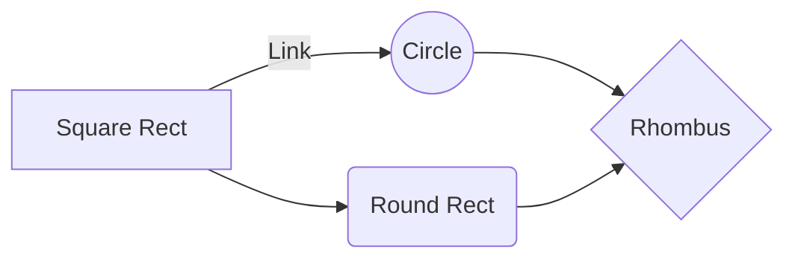
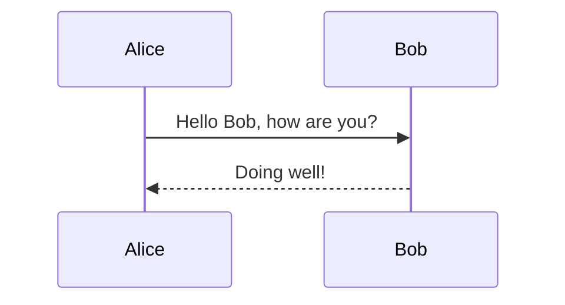

Headers
---------------------------

# Header 1

## Header 2

### Header 3

#### Header 4

##### Header 5

###### Header 6


Styling
---------------------------

*Emphasize* _emphasize_

**Strong** __strong__

***Strong emphasize***

==Marked text.==

~~Mistaken text.~~

> Quoted text.

H~2~O is a liquid.

2^10^ is 1024.


Lists
---------------------------

- Item
  * Item
    + Item

1. Item 1
2. Item 2
3. Item 3

- [ ] Incomplete item
- [x] Complete item


Links
---------------------------

A [link](http://example.com).

A [link with title](http://example.com "Hover me").

An auto-link: <http://example.com>

A reference [link][ref].

[ref]: http://example.com

An image: 

A sized image: 


Horizontal rule
---------------------------

---


Code
---------------------------

Some `inline code`.

```
// A code block
var foo = 'bar';
```

```javascript
// A highlighted block
var foo = 'bar';
```

    // Indented (4-space) code block
    var foo = 'bar';


Tables
---------------------------

Item     | Value
-------- | -----
Computer | $1600
Phone    | $12
Pipe     | $1


| Column 1 | Column 2      |
|:--------:| -------------:|
| centered | right-aligned |


Definition lists
---------------------------

Markdown
:  Text-to-HTML conversion tool

Authors
:  John
:  Luke


Footnotes
---------------------------

Some text with a footnote.[^1]

[^1]: The footnote.


Abbreviations
---------------------------

Markdown converts text to HTML.

*[HTML]: HyperText Markup Language


Smart typography
---------------------------

"Curly quotes" and 'apostrophes'.

en -- dash, em --- dash, ellipsis...


LaTeX math
---------------------------

Inline: $\Gamma(n) = (n-1)!$

Block:

$$
\Gamma(z) = \int_0^\infty t^{z-1}e^{-t}dt\,.
$$


Mermaid diagrams
---------------------------






Music notation (ABC)
---------------------------

```abc
X:1
T:Twinkle, Twinkle Little Star
M:4/4
L:1/4
K:C
| C C G G | A A G2 | F F E E | D D C2 |
```


Emoji
---------------------------

:rocket: :tada: :books: :smile: :+1:

ASCII shortcuts: :) :( ;)


Front matter
---------------------------

```yaml
---
title: My document
author: Jane Doe
date: 2026-04-27
---
```


Inline HTML
---------------------------

You can drop in raw <kbd>HTML</kbd> when markdown alone won't do.

<details>
<summary>Click to expand</summary>
Hidden content.
</details>
