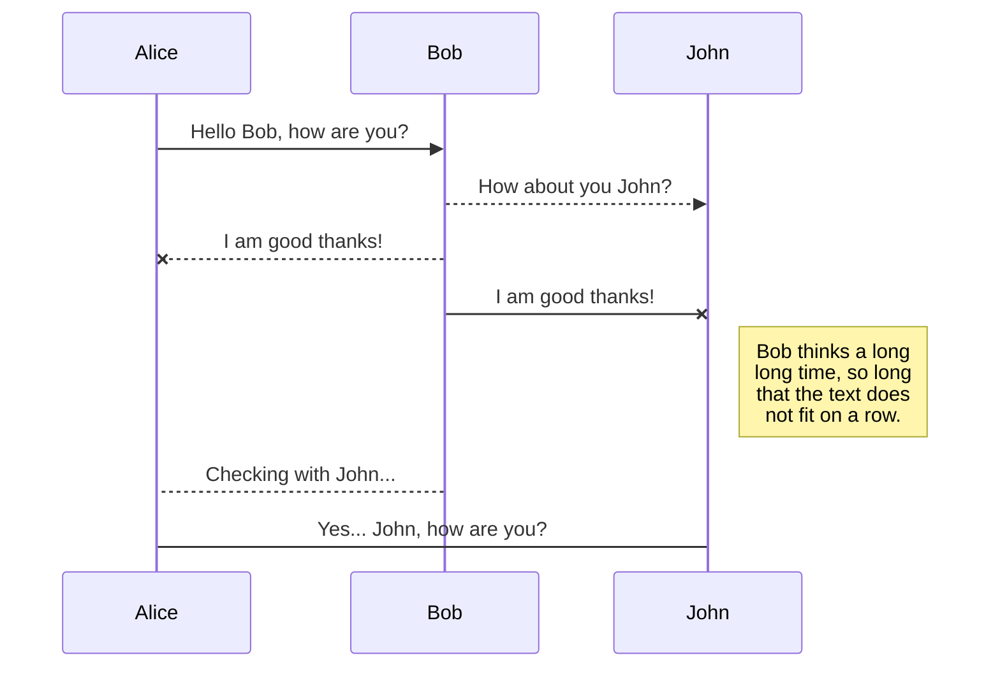
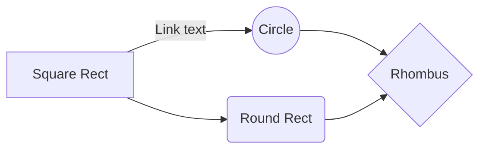

# Welcome to StackEdit!

Hi! I'm your first Markdown file in **StackEdit**. If you want to learn about StackEdit, you can read me. If you want to play with Markdown, you can edit me. Once you have finished with me, you can create new files by opening the **file explorer** on the left corner of the navigation bar.

> **Pro tip:** press **`Ctrl + K`** (or **`⌘ + K`** on Mac) at any time to open the **command palette** — a fuzzy-search popover over every toolbar action and shortcut, so you never have to hunt for a button.


# Files

StackEdit stores your files in your browser, which means all your files are automatically saved locally and are accessible **offline!**

## Create files and folders

The file explorer is accessible using the button in left corner of the navigation bar. You can create a new file by clicking the **New file** button in the file explorer. You can also create folders by clicking the **New folder** button.

You can also **drag and drop** `.md` files — or whole folders of them — straight onto the editor. They're imported into the current folder, and duplicate names are auto-renamed rather than overwritten.

## Switch to another file

All your files and folders are presented as a tree in the file explorer. You can switch from one to another by clicking a file in the tree.

## Rename a file

You can rename the current file by clicking the file name in the navigation bar or by clicking the **Rename** button in the file explorer. Right-clicking the filename also opens a context menu with **Rename**, **File properties**, **Copy path**, and **Close file**.

## Delete a file

You can delete the current file by clicking the **Remove** button in the file explorer. The file will be moved into the **Trash** folder and automatically deleted after 7 days of inactivity.

## Export a file

You can export the current file by clicking **Export to disk** in the menu. You can choose to export the file as plain Markdown, as HTML using a Handlebars template (plain, styled, or styled-with-table-of-contents), or as a PDF. The browser's own **Print** dialog (`Ctrl/⌘ + P`) also works — StackEdit ships a tuned print stylesheet that hides the chrome and renders just the preview, with link URLs printed inline after the link text.


# Synchronization

Synchronization is one of the biggest features of StackEdit. It enables you to synchronize any file in your workspace with other files stored in your **Google Drive**, your **Dropbox** and your **GitHub** accounts. This allows you to keep writing on other devices, collaborate with people you share the file with, integrate easily into your workflow... The synchronization mechanism takes place every minute in the background, downloading, merging, and uploading file modifications.

There are two types of synchronization and they can complement each other:

- The workspace synchronization will sync all your files, folders and settings automatically. This will allow you to fetch your workspace on any other device.
	> To start syncing your workspace, just sign in with Google in the menu.

- The file synchronization will keep one file of the workspace synced with one or multiple files in **Google Drive**, **Dropbox** or **GitHub**.
	> Before starting to sync files, you must link an account in the **Synchronize** sub-menu.

## Open a file

You can open a file from **Google Drive**, **Dropbox** or **GitHub** by opening the **Synchronize** sub-menu and clicking **Open from**. Once opened in the workspace, any modification in the file will be automatically synced.

## Save a file

You can save any file of the workspace to **Google Drive**, **Dropbox** or **GitHub** by opening the **Synchronize** sub-menu and clicking **Save on**. Even if a file in the workspace is already synced, you can save it to another location. StackEdit can sync one file with multiple locations and accounts.

## Synchronize a file

Once your file is linked to a synchronized location, StackEdit will periodically synchronize it by downloading/uploading any modification. A merge will be performed if necessary and conflicts will be resolved.

If you just have modified your file and you want to force syncing, click the **Synchronize now** button in the navigation bar — or press `Ctrl/⌘ + S`. When a real 3-way conflict happens (server *and* local edits to the same content from a shared baseline), StackEdit surfaces a notification so you know the merge wasn't trivial.

> **Note:** The **Synchronize now** button is disabled if you have no file to synchronize.

## Manage file synchronization

Since one file can be synced with multiple locations, you can list and manage synchronized locations by clicking **File synchronization** in the **Synchronize** sub-menu. This allows you to list and remove synchronized locations that are linked to your file.


# Publication

Publishing in StackEdit makes it simple for you to publish online your files. Once you're happy with a file, you can publish it to different hosting platforms like **Blogger**, **Dropbox**, **Gist**, **GitHub**, **Google Drive**, **WordPress** and **Zendesk**. With [Handlebars templates](http://handlebarsjs.com/), you have full control over what you export.

> Before starting to publish, you must link an account in the **Publish** sub-menu.

## Publish a File

You can publish your file by opening the **Publish** sub-menu and by clicking **Publish to**. For some locations, you can choose between the following formats:

- Markdown: publish the Markdown text on a website that can interpret it (**GitHub** for instance),
- HTML: publish the file converted to HTML via a Handlebars template (on a blog for example).

## Update a publication

After publishing, StackEdit keeps your file linked to that publication which makes it easy for you to re-publish it. Once you have modified your file and you want to update your publication, click on the **Publish now** button in the navigation bar.

> **Note:** The **Publish now** button is disabled if your file has not been published yet.

## Manage file publication

Since one file can be published to multiple locations, you can list and manage publish locations by clicking **File publication** in the **Publish** sub-menu. This allows you to list and remove publication locations that are linked to your file.


# Markdown extensions

StackEdit extends the standard Markdown syntax by adding extra **Markdown extensions**, providing you with some nice features.

> **ProTip:** You can disable any **Markdown extension** in the **File properties** dialog.


## SmartyPants

SmartyPants converts ASCII punctuation characters into "smart" typographic punctuation HTML entities. For example:

|                |ASCII                          |HTML                         |
|----------------|-------------------------------|-----------------------------|
|Single backticks|`'Isn't this fun?'`            |'Isn't this fun?'            |
|Quotes          |`"Isn't this fun?"`            |"Isn't this fun?"            |
|Dashes          |`-- is en-dash, --- is em-dash`|-- is en-dash, --- is em-dash|


## Tables

GitHub-flavored Markdown tables work out of the box. The **Insert table** toolbar button has built-in 2×2 / 3×3 / 4×3 / 5×4 / 10×4 presets to drop in a stub:

| Feature  | Status | Notes                            |
|----------|:------:|----------------------------------|
| Sync     | ✅     | Drive, Dropbox, GitHub           |
| Publish  | ✅     | Blogger, WordPress, Zendesk, …   |
| Mermaid  | ✅     | Click a diagram to enlarge       |

Cells respect alignment hints (`:---` left, `:---:` center, `---:` right).


## Task lists

Use `- [ ]` and `- [x]` to render interactive checkboxes:

- [x] Read this welcome file
- [ ] Connect Google Drive or GitHub
- [ ] Try the command palette (`Ctrl/⌘ + K`)
- [ ] Drag a folder of `.md` files onto the editor


## Footnotes

Add inline references with `[^id]`, then define them anywhere in the document:

Most browsers support clipboard-paste images[^paste], but only modern ones expose `navigator.clipboard.read()`[^secure].

[^paste]: Paste an image directly into the editor and StackEdit inserts it as a base64 data URL.
[^secure]: Requires HTTPS or localhost, plus a user gesture before the API will fire.


## Inline formatting

Beyond bold and italic, the default extension set ships a few more inline marks:

- Strikethrough: `~~outdated~~` renders as ~~outdated~~
- Highlight: `==important==` renders as ==important==
- Subscript: `H~2~O` renders as H~2~O
- Superscript: `E = mc^2^` renders as E = mc^2^


## Definition lists & abbreviations

Definition lists use a colon-prefix on the description line:

Markdown
:   A lightweight markup language for plain-text formatting.

CommonMark
:   A specification that pins down ambiguous Markdown corners.

Abbreviations are defined once at the bottom of the file and auto-tagged everywhere they appear — hover the tagged term to see the full form. The HTML spec is maintained by the W3C.

*[HTML]: HyperText Markup Language
*[W3C]: World Wide Web Consortium


## Image dimensions

Append ` =WIDTHxHEIGHT` (markdown-it-imsize syntax — note the **space before `=`**) inside the link parens to size an image without raw HTML. Either dimension can be omitted: ` =300x` is width-only, ` =x200` is height-only.


The image above is sized via ``. The **Insert image** toolbar dropdown emits the export-friendly `{width=300}` attribute syntax instead — recognized by Hugo / kramdown / pandoc but **ignored** by StackEdit's in-app preview, so use `=WIDTHxHEIGHT` if you want the dimensions to apply here too.


## Emoji

Type emoji shortcodes like `:rocket:` :rocket:, `:tada:` :tada:, or `:books:` :books: and the preview replaces them. ASCII shortcuts like `:)` and `:(` also work when the emoji extension is on.


## KaTeX

You can render LaTeX mathematical expressions using [KaTeX](https://khan.github.io/KaTeX/):

The *Gamma function* satisfying $\Gamma(n) = (n-1)!\quad\forall n\in\mathbb N$ is via the Euler integral

$$
\Gamma(z) = \int_0^\infty t^{z-1}e^{-t}dt\,.
$$

> You can find more information about **LaTeX** mathematical expressions [here](http://meta.math.stackexchange.com/questions/5020/mathjax-basic-tutorial-and-quick-reference).


## UML diagrams

You can render UML diagrams using [Mermaid](https://mermaidjs.github.io/). For example, this will produce a sequence diagram:



And this will produce a flow chart:



> Click any rendered diagram to open the **lightbox** — pan, zoom (mouse wheel or `+` / `-`), reset (`0`), and fit-to-viewport (`f`). Vector re-layout at every zoom step keeps text crisp.


## Music notation

You can render sheet music with [ABC notation](https://abcnotation.com/). The example below renders a short tune:

```abc
X:1
T:Twinkle, Twinkle Little Star
M:4/4
L:1/4
K:C
| C C G G | A A G2 | F F E E | D D C2 |
| G G F F | E E D2 | G G F F | E E D2 |
| C C G G | A A G2 | F F E E | D D C2 |
```


# Editor power features

A few things worth discovering once you've settled in:

## Command palette

Press **`Ctrl/⌘ + K`** — or **`Ctrl/⌘ + /`** for the slash-command alias — to open a fuzzy-search popover over every toolbar action: bold, headings, callouts, tables, math, mermaid, music, tidy, case-convert, and the rest. Arrow keys navigate, **Enter** runs, **Escape** closes.

## View toggles

The right-side button bar flips view-mode toggles without touching settings:

- **Focus mode** — keeps the caret vertically centered (typewriter scrolling).
- **Scroll sync** — editor and preview track each other as you scroll.
- **Line numbers** — adds a left gutter to the editor.
- **Reader mode** — hides the editor and shows the rendered preview at full width.

## Find & replace

Press **`Ctrl/⌘ + F`** to open find, **`Ctrl/⌘ + Alt + F`** to open replace. The case-sensitive and regular-expression toggles persist between sessions.

## Drag-and-drop import

Drop `.md` files or whole folder trees on the editor to import them into the current folder. Drop image files (any format) to insert them inline as base64 data URLs — works offline, no upload service required.

## Outline fold for the TOC

Open the **Table of contents** sidebar and click the **H1 / H2 / … / H6** chips at the top to collapse the outline below that heading level. Useful for skimming long documents.

## Toolbar extras

Some toolbar buttons surface less-obvious features:

- **Heading picker (H1–H6)** — replaces the cycle-through-three-levels behavior; pick the exact level for the current line.
- **Callout / admonition** dropdown inserts GFM `> [!NOTE]`, `[!TIP]`, `[!IMPORTANT]`, `[!WARNING]`, or `[!CAUTION]` blocks. Renders as a plain blockquote inside StackEdit; styled on GitHub, Obsidian, and many readers.
- **YAML front-matter** drops a `title / author / date / tags` stub at the top of the doc — what static-site generators like Hugo and Jekyll expect.
- **Wiki link** wraps the selection as `[[Page Name]]` for export to Obsidian / Foam / Logseq.
- **Convert case** transforms the selection to UPPERCASE, lowercase, Title Case, Sentence case, snake_case, or kebab-case.
- **Sort lines** alphabetizes the selected lines (or the current paragraph) using `localeCompare`.
- **Special characters** dropdown gives one-click access to em-dash, en-dash, ellipsis, curly quotes, arrows, ©®™, fractions, and common math operators.
- **Insert date** drops `YYYY-MM-DD` (ISO, locale-neutral) or `YYYY-MM-DD HH:mm`.
- **Link from clipboard** reads `navigator.clipboard.readText()` — if it's a URL, wraps the selection as `[text](url)` in one click.
- **Auto-link on paste** — pasting a bare URL while text is selected wraps it as `[selected](url)` automatically (no toolbar trip needed).
- **Tidy markdown** (the magic-wand button) trims trailing whitespace, collapses blank-line stacks, normalizes EOF, and adds a space after `#` / `-` / `*` markers — leaving fenced code blocks alone.

## Text expansions

Two built-in input sequences turn ASCII into typographic arrows:

- `==>` then space → ⇒
- `<==` then space → ⇐


# Welcome aboard

Once you're comfortable, sign in with Google in the menu to sync your workspace across devices, or link a GitHub / Dropbox account from the **Synchronize** sub-menu to back up individual files. Everything you've read here is editable — feel free to delete this file once you've poked around.

> Written with [StackEdit](https://stackedit.io/).
