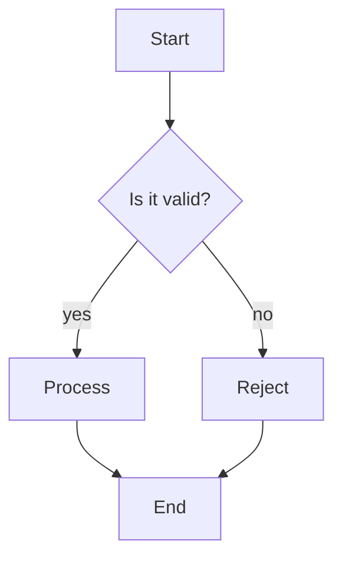
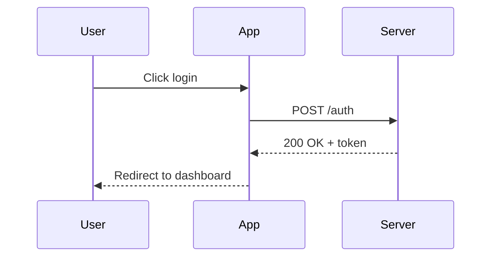
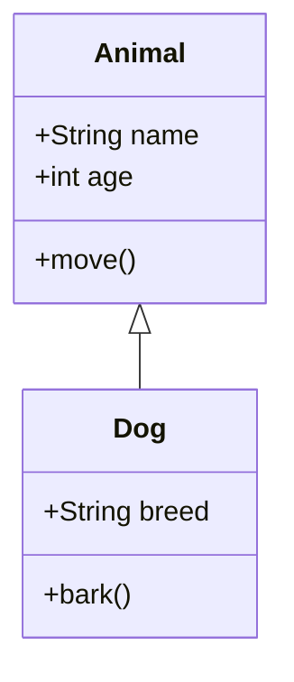
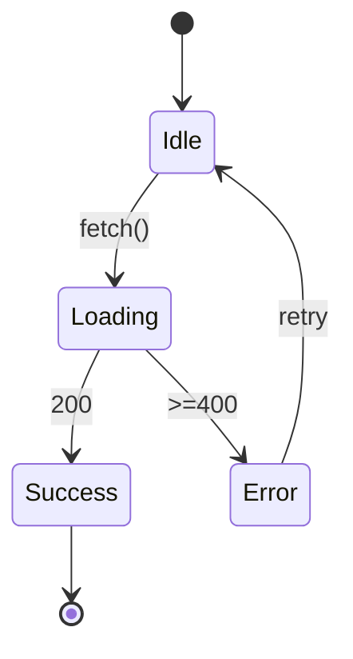
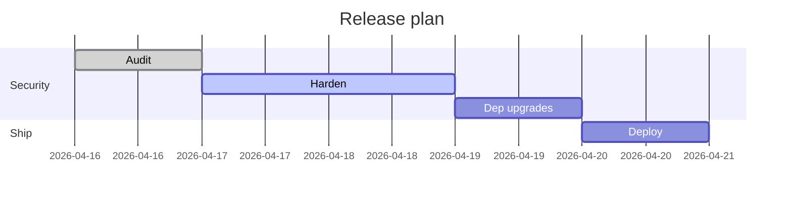
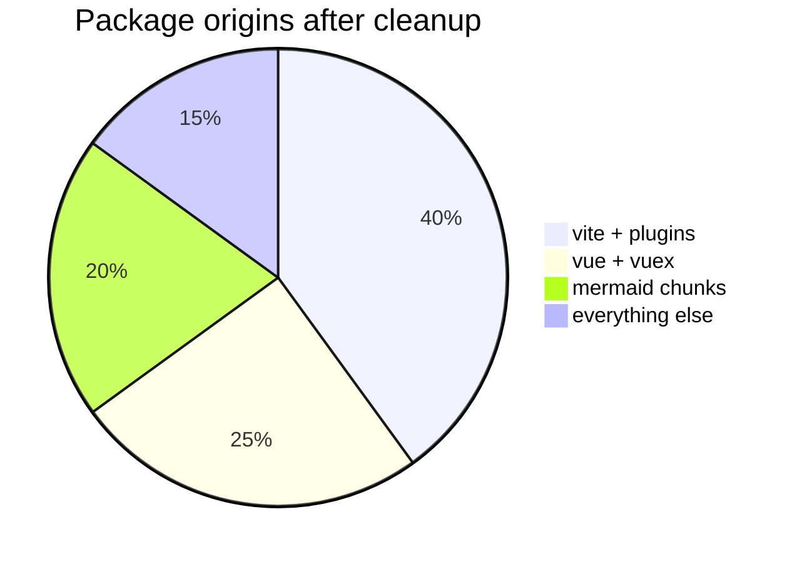
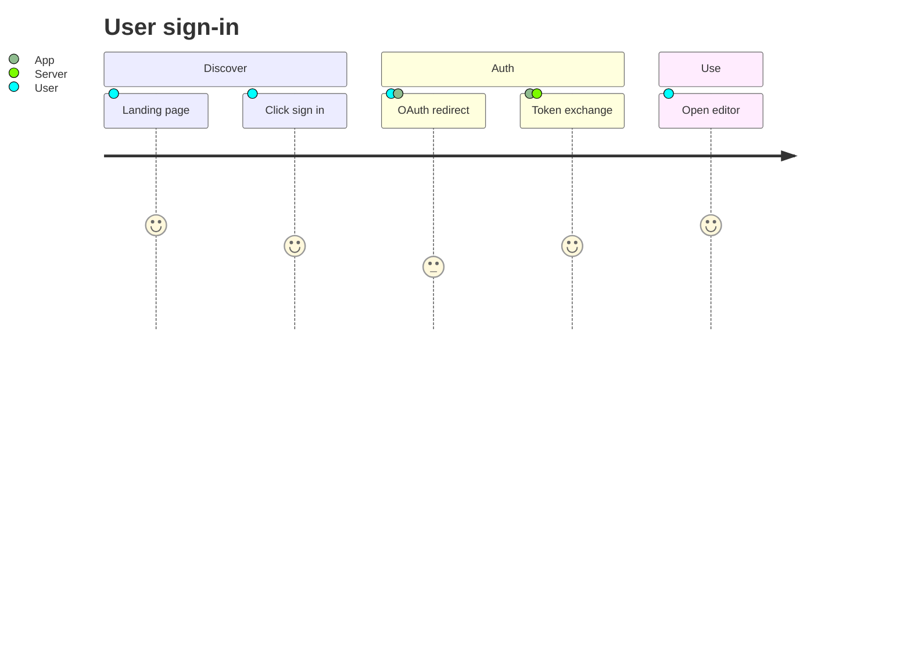
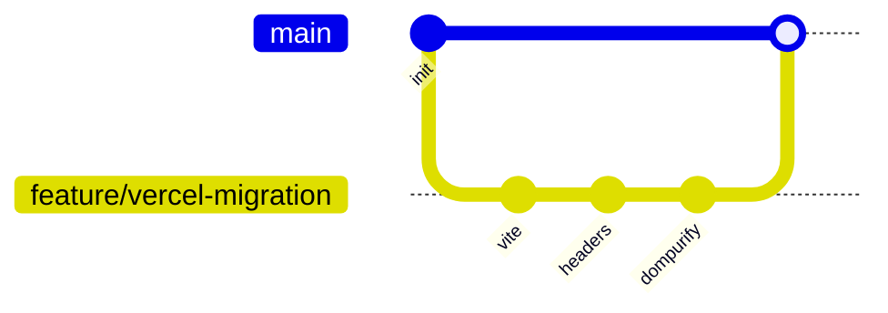

# Mermaid smoke test (v11.4.1)

Paste into StackEdit. Every fenced `mermaid` block should render as an SVG in the preview (right pane). Each diagram type below exercises a different lazy-loaded Mermaid chunk.

## Flowchart



## Sequence



## Class



## State



## Gantt



## Pie



## Journey



## Git graph



## Intentional parse error — should log to console, preview should still render the rest

```mermaid
flowchart TD
  A --> B -- syntax error here ?
```
